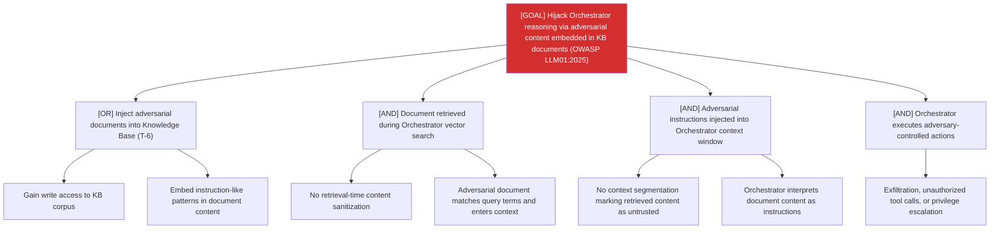

# Attack Tree: LLM-2 — LLM Agent Orchestrator

**Risk Level**: Critical
**Component**: LLM Agent Orchestrator
**Threat**: Indirect prompt injection via adversarial Knowledge Base documents

```mermaid
graph TD
    Goal["[GOAL] Hijack Orchestrator reasoning via adversarial content embedded in KB documents (OWASP LLM01:2025)"]
    Goal --> A["[OR] Inject adversarial documents into Knowledge Base (T-6)"]
    A --> A1["Gain write access to KB corpus"]
    A --> A2["Embed instruction-like patterns in document content"]
    Goal --> B["[AND] Document retrieved during Orchestrator vector search"]
    B --> B1["No retrieval-time content sanitization"]
    B --> B2["Adversarial document matches query terms and enters context"]
    Goal --> C["[AND] Adversarial instructions injected into Orchestrator context window"]
    C --> C1["No context segmentation marking retrieved content as untrusted"]
    C --> C2["Orchestrator interprets document content as instructions"]
    Goal --> D["[AND] Orchestrator executes adversary-controlled actions"]
    D --> D1["Exfiltration, unauthorized tool calls, or privilege escalation"]
    classDef critical fill:#d32f2f,color:#fff
    class Goal critical
```
