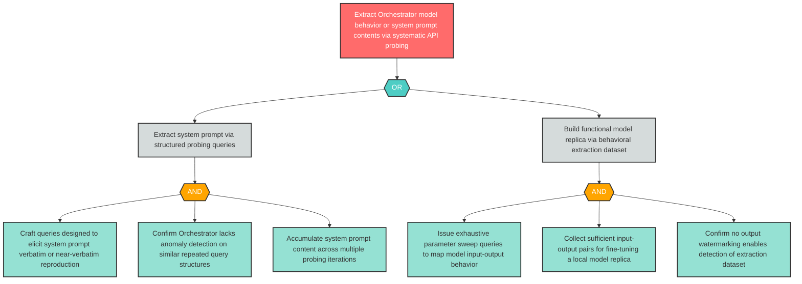

# Attack Tree: LLM-3 — Model Theft via Systematic API Probing and Behavior Extraction

**Finding ID**: LLM-3
**Risk Level**: High
**Component**: LLM Agent Orchestrator
**Delta Status**: UNCHANGED

```mermaid
flowchart TD
    LLM3_root["Extract Orchestrator model behavior or system prompt contents via systematic API probing"]
    LLM3_or1{{"OR"}}
    LLM3_sub1["Extract system prompt via structured probing queries"]
    LLM3_sub2["Build functional model replica via behavioral extraction dataset"]
    LLM3_and1{{"AND"}}
    LLM3_leaf1["Craft queries designed to elicit system prompt verbatim or near-verbatim reproduction"]
    LLM3_leaf2["Confirm Orchestrator lacks anomaly detection on similar repeated query structures"]
    LLM3_leaf3["Accumulate system prompt content across multiple probing iterations"]
    LLM3_and2{{"AND"}}
    LLM3_leaf4["Issue exhaustive parameter sweep queries to map model input-output behavior"]
    LLM3_leaf5["Collect sufficient input-output pairs for fine-tuning a local model replica"]
    LLM3_leaf6["Confirm no output watermarking enables detection of extraction dataset"]

    LLM3_root --> LLM3_or1
    LLM3_or1 --> LLM3_sub1
    LLM3_or1 --> LLM3_sub2
    LLM3_sub1 --> LLM3_and1
    LLM3_and1 --> LLM3_leaf1
    LLM3_and1 --> LLM3_leaf2
    LLM3_and1 --> LLM3_leaf3
    LLM3_sub2 --> LLM3_and2
    LLM3_and2 --> LLM3_leaf4
    LLM3_and2 --> LLM3_leaf5
    LLM3_and2 --> LLM3_leaf6

    classDef goal fill:#ff6b6b,stroke:#333,stroke-width:2px,color:#fff
    classDef andGate fill:#ffa500,stroke:#333,stroke-width:2px,color:#fff
    classDef orGate fill:#4ecdc4,stroke:#333,stroke-width:2px,color:#fff
    classDef subGoal fill:#d5dbdb,stroke:#333,stroke-width:2px,color:#333
    classDef leaf fill:#95e1d3,stroke:#333,stroke-width:2px,color:#333

    class LLM3_root goal
    class LLM3_or1 orGate
    class LLM3_and1,LLM3_and2 andGate
    class LLM3_sub1,LLM3_sub2 subGoal
    class LLM3_leaf1,LLM3_leaf2,LLM3_leaf3,LLM3_leaf4,LLM3_leaf5,LLM3_leaf6 leaf
```
