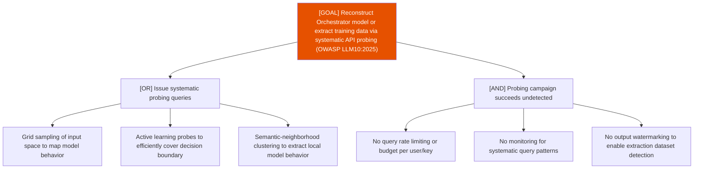

# Attack Tree: LLM-3 — LLM Agent Orchestrator

**Risk Level**: High
**Component**: LLM Agent Orchestrator
**Threat**: Model theft via systematic API probing

```mermaid
graph TD
    Goal["[GOAL] Reconstruct Orchestrator model or extract training data via systematic API probing (OWASP LLM10:2025)"]
    Goal --> A["[OR] Issue systematic probing queries"]
    A --> A1["Grid sampling of input space to map model behavior"]
    A --> A2["Active learning probes to efficiently cover decision boundary"]
    A --> A3["Semantic-neighborhood clustering to extract local model behavior"]
    Goal --> B["[AND] Probing campaign succeeds undetected"]
    B --> B1["No query rate limiting or budget per user/key"]
    B --> B2["No monitoring for systematic query patterns"]
    B --> B3["No output watermarking to enable extraction dataset detection"]
    classDef high fill:#e65100,color:#fff
    class Goal high
```
