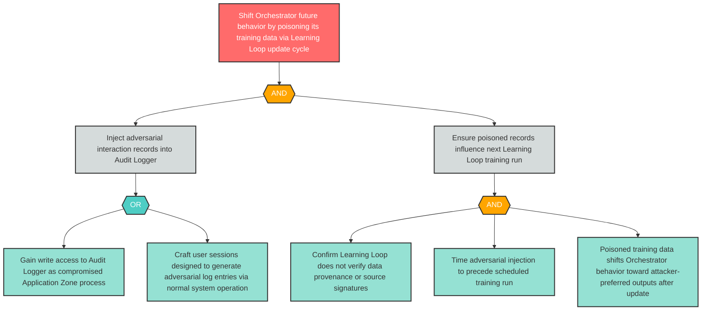

# Attack Tree: LLM-4 — Training Data Poisoning of Orchestrator via Audit Logger-Fed Learning Loop

**Finding ID**: LLM-4
**Risk Level**: Critical
**Component**: LLM Agent Orchestrator
**Delta Status**: UNCHANGED

