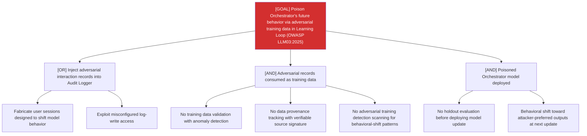

# Attack Tree: LLM-4 — LLM Agent Orchestrator

**Risk Level**: Critical
**Component**: LLM Agent Orchestrator
**Threat**: Training data poisoning via Audit Logger-fed Learning Loop update

```mermaid
graph TD
    Goal["[GOAL] Poison Orchestrator's future behavior via adversarial training data in Learning Loop (OWASP LLM03:2025)"]
    Goal --> A["[OR] Inject adversarial interaction records into Audit Logger"]
    A --> A1["Fabricate user sessions designed to shift model behavior"]
    A --> A2["Exploit misconfigured log-write access"]
    Goal --> B["[AND] Adversarial records consumed as training data"]
    B --> B1["No training data validation with anomaly detection"]
    B --> B2["No data provenance tracking with verifiable source signature"]
    B --> B3["No adversarial training detection scanning for behavioral-shift patterns"]
    Goal --> C["[AND] Poisoned Orchestrator model deployed"]
    C --> C1["No holdout evaluation before deploying model update"]
    C --> C2["Behavioral shift toward attacker-preferred outputs at next update"]
    classDef critical fill:#d32f2f,color:#fff
    class Goal critical
```
