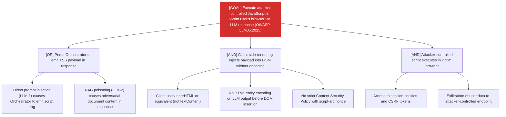

# Attack Tree: LLM-5 — LLM Agent Orchestrator

**Risk Level**: Critical
**Component**: LLM Agent Orchestrator
**Threat**: Client-side XSS via LLM response rendered in browser

```mermaid
graph TD
    Goal["[GOAL] Execute attacker-controlled JavaScript in victim user's browser via LLM response (OWASP LLM05:2025)"]
    Goal --> A["[OR] Prime Orchestrator to emit XSS payload in response"]
    A --> A1["Direct prompt injection (LLM-1) causes Orchestrator to emit script tag"]
    A --> A2["RAG poisoning (LLM-2) causes adversarial document content in response"]
    Goal --> B["[AND] Client-side rendering injects payload into DOM without encoding"]
    B --> B1["Client uses innerHTML or equivalent (not textContent)"]
    B --> B2["No HTML entity encoding on LLM output before DOM insertion"]
    B --> B3["No strict Content Security Policy with script-src nonce"]
    Goal --> C["[AND] Attacker-controlled script executes in victim browser"]
    C --> C1["Access to session cookies and CSRF tokens"]
    C --> C2["Exfiltration of user data to attacker-controlled endpoint"]
    classDef critical fill:#d32f2f,color:#fff
    class Goal critical
```
