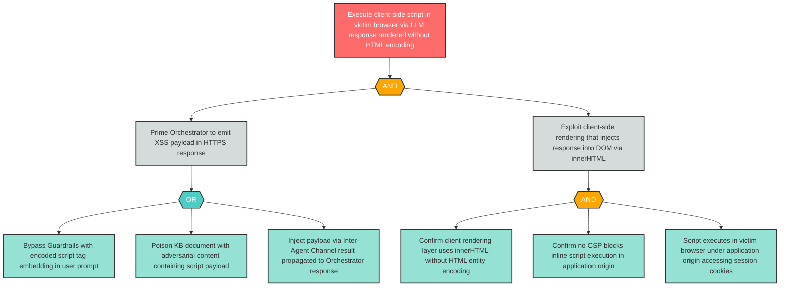

# Attack Tree: LLM-5 — Client-Side XSS via LLM Response Rendered in Browser

**Finding ID**: LLM-5
**Risk Level**: Critical
**Component**: LLM Agent Orchestrator
**Delta Status**: UNCHANGED

```mermaid
flowchart TD
    LLM5_root["Execute client-side script in victim browser via LLM response rendered without HTML encoding"]
    LLM5_and1{{"AND"}}
    LLM5_sub1["Prime Orchestrator to emit XSS payload in HTTPS response"]
    LLM5_sub2["Exploit client-side rendering that injects response into DOM via innerHTML"]
    LLM5_or1{{"OR"}}
    LLM5_leaf1["Bypass Guardrails with encoded script tag embedding in user prompt"]
    LLM5_leaf2["Poison KB document with adversarial content containing script payload"]
    LLM5_leaf3["Inject payload via Inter-Agent Channel result propagated to Orchestrator response"]
    LLM5_and2{{"AND"}}
    LLM5_leaf4["Confirm client rendering layer uses innerHTML without HTML entity encoding"]
    LLM5_leaf5["Confirm no CSP blocks inline script execution in application origin"]
    LLM5_leaf6["Script executes in victim browser under application origin accessing session cookies"]

    LLM5_root --> LLM5_and1
    LLM5_and1 --> LLM5_sub1
    LLM5_and1 --> LLM5_sub2
    LLM5_sub1 --> LLM5_or1
    LLM5_or1 --> LLM5_leaf1
    LLM5_or1 --> LLM5_leaf2
    LLM5_or1 --> LLM5_leaf3
    LLM5_sub2 --> LLM5_and2
    LLM5_and2 --> LLM5_leaf4
    LLM5_and2 --> LLM5_leaf5
    LLM5_and2 --> LLM5_leaf6

    classDef goal fill:#ff6b6b,stroke:#333,stroke-width:2px,color:#fff
    classDef andGate fill:#ffa500,stroke:#333,stroke-width:2px,color:#fff
    classDef orGate fill:#4ecdc4,stroke:#333,stroke-width:2px,color:#fff
    classDef subGoal fill:#d5dbdb,stroke:#333,stroke-width:2px,color:#333
    classDef leaf fill:#95e1d3,stroke:#333,stroke-width:2px,color:#333

    class LLM5_root goal
    class LLM5_and1,LLM5_and2 andGate
    class LLM5_or1 orGate
    class LLM5_sub1,LLM5_sub2 subGoal
    class LLM5_leaf1,LLM5_leaf2,LLM5_leaf3,LLM5_leaf4,LLM5_leaf5,LLM5_leaf6 leaf
```
