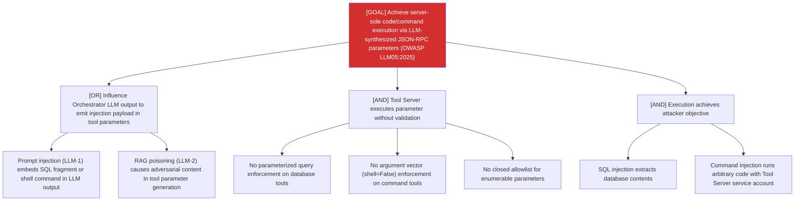

# Attack Tree: LLM-6 — LLM Agent Orchestrator

**Risk Level**: Critical
**Component**: LLM Agent Orchestrator
**Threat**: Server-side execution via LLM-generated tool call parameters

```mermaid
graph TD
    Goal["[GOAL] Achieve server-side code/command execution via LLM-synthesized JSON-RPC parameters (OWASP LLM05:2025)"]
    Goal --> A["[OR] Influence Orchestrator LLM output to emit injection payload in tool parameters"]
    A --> A1["Prompt injection (LLM-1) embeds SQL fragment or shell command in LLM output"]
    A --> A2["RAG poisoning (LLM-2) causes adversarial content in tool parameter generation"]
    Goal --> B["[AND] Tool Server executes parameter without validation"]
    B --> B1["No parameterized query enforcement on database tools"]
    B --> B2["No argument vector (shell=False) enforcement on command tools"]
    B --> B3["No closed allowlist for enumerable parameters"]
    Goal --> C["[AND] Execution achieves attacker objective"]
    C --> C1["SQL injection extracts database contents"]
    C --> C2["Command injection runs arbitrary code with Tool Server service account"]
    classDef critical fill:#d32f2f,color:#fff
    class Goal critical
```
