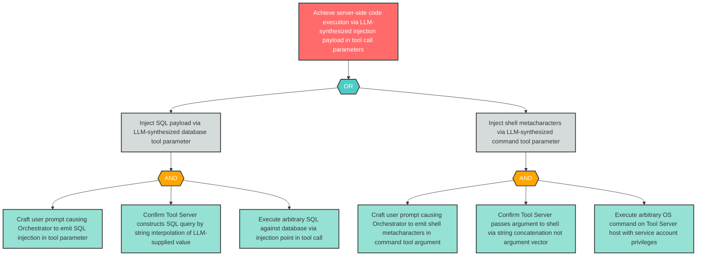

# Attack Tree: LLM-6 — Server-Side Code Execution via LLM-Synthesized Tool Call Parameters

**Finding ID**: LLM-6
**Risk Level**: Critical
**Component**: LLM Agent Orchestrator
**Delta Status**: UNCHANGED

