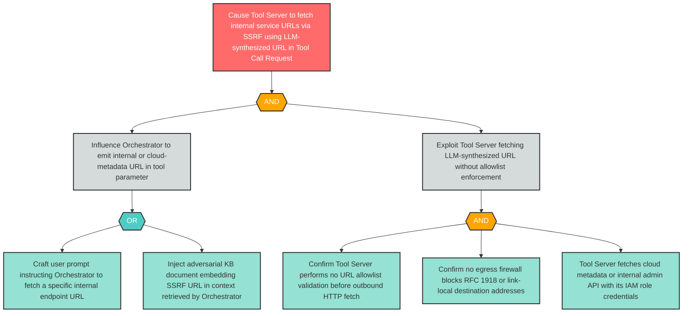

# Attack Tree: LLM-7 — SSRF via LLM-Synthesized URL in Tool Call Request

**Finding ID**: LLM-7
**Risk Level**: High
**Component**: LLM Agent Orchestrator
**Delta Status**: UNCHANGED

```mermaid
flowchart TD
    LLM7_root["Cause Tool Server to fetch internal service URLs via SSRF using LLM-synthesized URL in Tool Call Request"]
    LLM7_and1{{"AND"}}
    LLM7_sub1["Influence Orchestrator to emit internal or cloud-metadata URL in tool parameter"]
    LLM7_sub2["Exploit Tool Server fetching LLM-synthesized URL without allowlist enforcement"]
    LLM7_or1{{"OR"}}
    LLM7_leaf1["Craft user prompt instructing Orchestrator to fetch a specific internal endpoint URL"]
    LLM7_leaf2["Inject adversarial KB document embedding SSRF URL in context retrieved by Orchestrator"]
    LLM7_and2{{"AND"}}
    LLM7_leaf3["Confirm Tool Server performs no URL allowlist validation before outbound HTTP fetch"]
    LLM7_leaf4["Confirm no egress firewall blocks RFC 1918 or link-local destination addresses"]
    LLM7_leaf5["Tool Server fetches cloud metadata or internal admin API with its IAM role credentials"]

    LLM7_root --> LLM7_and1
    LLM7_and1 --> LLM7_sub1
    LLM7_and1 --> LLM7_sub2
    LLM7_sub1 --> LLM7_or1
    LLM7_or1 --> LLM7_leaf1
    LLM7_or1 --> LLM7_leaf2
    LLM7_sub2 --> LLM7_and2
    LLM7_and2 --> LLM7_leaf3
    LLM7_and2 --> LLM7_leaf4
    LLM7_and2 --> LLM7_leaf5

    classDef goal fill:#ff6b6b,stroke:#333,stroke-width:2px,color:#fff
    classDef andGate fill:#ffa500,stroke:#333,stroke-width:2px,color:#fff
    classDef orGate fill:#4ecdc4,stroke:#333,stroke-width:2px,color:#fff
    classDef subGoal fill:#d5dbdb,stroke:#333,stroke-width:2px,color:#333
    classDef leaf fill:#95e1d3,stroke:#333,stroke-width:2px,color:#333

    class LLM7_root goal
    class LLM7_and1,LLM7_and2 andGate
    class LLM7_or1 orGate
    class LLM7_sub1,LLM7_sub2 subGoal
    class LLM7_leaf1,LLM7_leaf2,LLM7_leaf3,LLM7_leaf4,LLM7_leaf5 leaf
```
