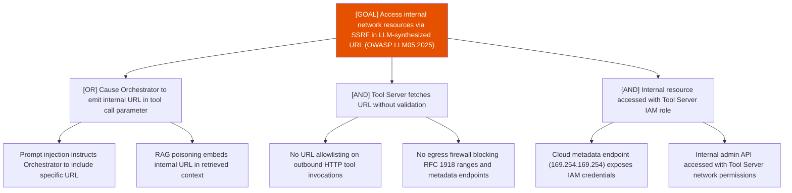

# Attack Tree: LLM-7 — LLM Agent Orchestrator

**Risk Level**: High
**Component**: LLM Agent Orchestrator
**Threat**: SSRF via LLM-synthesized URL in Tool Call Request

```mermaid
graph TD
    Goal["[GOAL] Access internal network resources via SSRF in LLM-synthesized URL (OWASP LLM05:2025)"]
    Goal --> A["[OR] Cause Orchestrator to emit internal URL in tool call parameter"]
    A --> A1["Prompt injection instructs Orchestrator to include specific URL"]
    A --> A2["RAG poisoning embeds internal URL in retrieved context"]
    Goal --> B["[AND] Tool Server fetches URL without validation"]
    B --> B1["No URL allowlisting on outbound HTTP tool invocations"]
    B --> B2["No egress firewall blocking RFC 1918 ranges and metadata endpoints"]
    Goal --> C["[AND] Internal resource accessed with Tool Server IAM role"]
    C --> C1["Cloud metadata endpoint (169.254.169.254) exposes IAM credentials"]
    C --> C2["Internal admin API accessed with Tool Server network permissions"]
    classDef high fill:#e65100,color:#fff
    class Goal high
```
