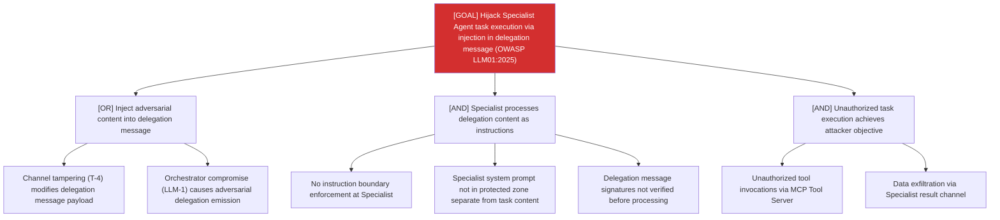

# Attack Tree: LLM-8 — Specialist Agent

**Risk Level**: Critical
**Component**: Specialist Agent
**Threat**: Prompt injection via adversarial delegation messages hijacks task execution

```mermaid
graph TD
    Goal["[GOAL] Hijack Specialist Agent task execution via injection in delegation message (OWASP LLM01:2025)"]
    Goal --> A["[OR] Inject adversarial content into delegation message"]
    A --> A1["Channel tampering (T-4) modifies delegation message payload"]
    A --> A2["Orchestrator compromise (LLM-1) causes adversarial delegation emission"]
    Goal --> B["[AND] Specialist processes delegation content as instructions"]
    B --> B1["No instruction boundary enforcement at Specialist"]
    B --> B2["Specialist system prompt not in protected zone separate from task content"]
    B --> B3["Delegation message signatures not verified before processing"]
    Goal --> C["[AND] Unauthorized task execution achieves attacker objective"]
    C --> C1["Unauthorized tool invocations via MCP Tool Server"]
    C --> C2["Data exfiltration via Specialist result channel"]
    classDef critical fill:#d32f2f,color:#fff
    class Goal critical
```
