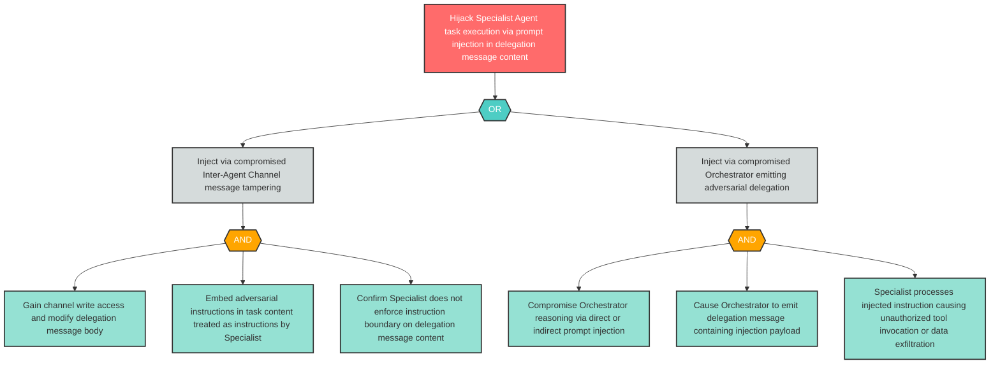

# Attack Tree: LLM-8 — Prompt Injection via Adversarial Delegation Messages Hijacks Specialist Execution

**Finding ID**: LLM-8
**Risk Level**: Critical
**Component**: Specialist Agent
**Delta Status**: UNCHANGED

