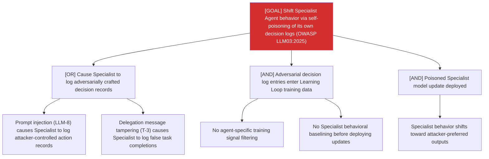

# Attack Tree: LLM-9 — Specialist Agent

**Risk Level**: Critical
**Component**: Specialist Agent
**Threat**: Training data poisoning via Specialist self-poisoning decision log loop

```mermaid
graph TD
    Goal["[GOAL] Shift Specialist Agent behavior via self-poisoning of its own decision logs (OWASP LLM03:2025)"]
    Goal --> A["[OR] Cause Specialist to log adversarially crafted decision records"]
    A --> A1["Prompt injection (LLM-8) causes Specialist to log attacker-controlled action records"]
    A --> A2["Delegation message tampering (T-3) causes Specialist to log false task completions"]
    Goal --> B["[AND] Adversarial decision log entries enter Learning Loop training data"]
    B --> B1["No agent-specific training signal filtering"]
    B --> B2["No Specialist behavioral baselining before deploying updates"]
    Goal --> C["[AND] Poisoned Specialist model update deployed"]
    C --> C1["Specialist behavior shifts toward attacker-preferred outputs"]
    classDef critical fill:#d32f2f,color:#fff
    class Goal critical
```
