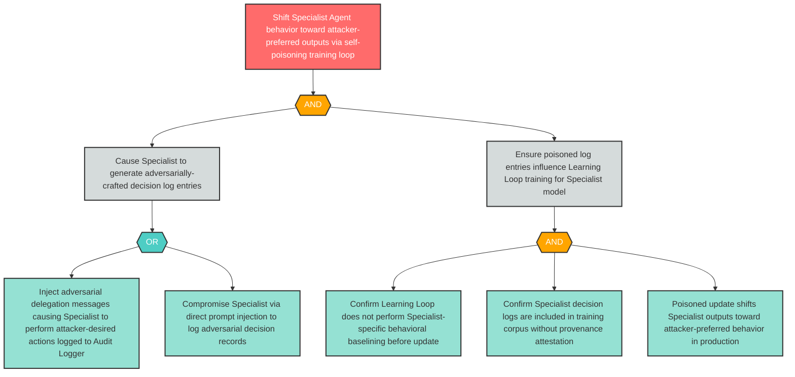

# Attack Tree: LLM-9 — Training Data Poisoning via Specialist Agent Self-Poisoning Loop

**Finding ID**: LLM-9
**Risk Level**: Critical
**Component**: Specialist Agent
**Delta Status**: UNCHANGED

```mermaid
flowchart TD
    LLM9_root["Shift Specialist Agent behavior toward attacker-preferred outputs via self-poisoning training loop"]
    LLM9_and1{{"AND"}}
    LLM9_sub1["Cause Specialist to generate adversarially-crafted decision log entries"]
    LLM9_sub2["Ensure poisoned log entries influence Learning Loop training for Specialist model"]
    LLM9_or1{{"OR"}}
    LLM9_leaf1["Inject adversarial delegation messages causing Specialist to perform attacker-desired actions logged to Audit Logger"]
    LLM9_leaf2["Compromise Specialist via direct prompt injection to log adversarial decision records"]
    LLM9_and2{{"AND"}}
    LLM9_leaf3["Confirm Learning Loop does not perform Specialist-specific behavioral baselining before update"]
    LLM9_leaf4["Confirm Specialist decision logs are included in training corpus without provenance attestation"]
    LLM9_leaf5["Poisoned update shifts Specialist outputs toward attacker-preferred behavior in production"]

    LLM9_root --> LLM9_and1
    LLM9_and1 --> LLM9_sub1
    LLM9_and1 --> LLM9_sub2
    LLM9_sub1 --> LLM9_or1
    LLM9_or1 --> LLM9_leaf1
    LLM9_or1 --> LLM9_leaf2
    LLM9_sub2 --> LLM9_and2
    LLM9_and2 --> LLM9_leaf3
    LLM9_and2 --> LLM9_leaf4
    LLM9_and2 --> LLM9_leaf5

    classDef goal fill:#ff6b6b,stroke:#333,stroke-width:2px,color:#fff
    classDef andGate fill:#ffa500,stroke:#333,stroke-width:2px,color:#fff
    classDef orGate fill:#4ecdc4,stroke:#333,stroke-width:2px,color:#fff
    classDef subGoal fill:#d5dbdb,stroke:#333,stroke-width:2px,color:#333
    classDef leaf fill:#95e1d3,stroke:#333,stroke-width:2px,color:#333

    class LLM9_root goal
    class LLM9_and1,LLM9_and2 andGate
    class LLM9_or1 orGate
    class LLM9_sub1,LLM9_sub2 subGoal
    class LLM9_leaf1,LLM9_leaf2,LLM9_leaf3,LLM9_leaf4,LLM9_leaf5 leaf
```
