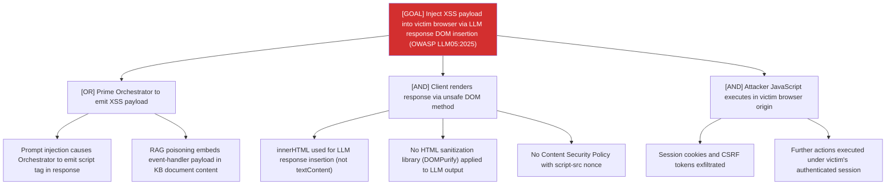

# Attack Tree: OI-1 — LLM Agent Orchestrator

**Risk Level**: Critical
**Component**: LLM Agent Orchestrator
**Threat**: Client-side XSS via LLM response in browser DOM (OWASP LLM05:2025)

```mermaid
graph TD
    Goal["[GOAL] Inject XSS payload into victim browser via LLM response DOM insertion (OWASP LLM05:2025)"]
    Goal --> A["[OR] Prime Orchestrator to emit XSS payload"]
    A --> A1["Prompt injection causes Orchestrator to emit script tag in response"]
    A --> A2["RAG poisoning embeds event-handler payload in KB document content"]
    Goal --> B["[AND] Client renders response via unsafe DOM method"]
    B --> B1["innerHTML used for LLM response insertion (not textContent)"]
    B --> B2["No HTML sanitization library (DOMPurify) applied to LLM output"]
    B --> B3["No Content Security Policy with script-src nonce"]
    Goal --> C["[AND] Attacker JavaScript executes in victim browser origin"]
    C --> C1["Session cookies and CSRF tokens exfiltrated"]
    C --> C2["Further actions executed under victim's authenticated session"]
    classDef critical fill:#d32f2f,color:#fff
    class Goal critical
```
