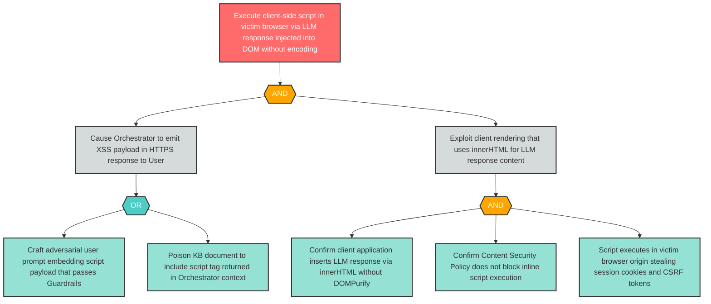

# Attack Tree: OI-1 — Client-Side XSS via LLM Response to User Browser

**Finding ID**: OI-1
**Risk Level**: Critical
**Component**: LLM Agent Orchestrator
**Delta Status**: UNCHANGED

```mermaid
flowchart TD
    OI1_root["Execute client-side script in victim browser via LLM response injected into DOM without encoding"]
    OI1_and1{{"AND"}}
    OI1_sub1["Cause Orchestrator to emit XSS payload in HTTPS response to User"]
    OI1_sub2["Exploit client rendering that uses innerHTML for LLM response content"]
    OI1_or1{{"OR"}}
    OI1_leaf1["Craft adversarial user prompt embedding script payload that passes Guardrails"]
    OI1_leaf2["Poison KB document to include script tag returned in Orchestrator context"]
    OI1_and2{{"AND"}}
    OI1_leaf3["Confirm client application inserts LLM response via innerHTML without DOMPurify"]
    OI1_leaf4["Confirm Content Security Policy does not block inline script execution"]
    OI1_leaf5["Script executes in victim browser origin stealing session cookies and CSRF tokens"]

    OI1_root --> OI1_and1
    OI1_and1 --> OI1_sub1
    OI1_and1 --> OI1_sub2
    OI1_sub1 --> OI1_or1
    OI1_or1 --> OI1_leaf1
    OI1_or1 --> OI1_leaf2
    OI1_sub2 --> OI1_and2
    OI1_and2 --> OI1_leaf3
    OI1_and2 --> OI1_leaf4
    OI1_and2 --> OI1_leaf5

    classDef goal fill:#ff6b6b,stroke:#333,stroke-width:2px,color:#fff
    classDef andGate fill:#ffa500,stroke:#333,stroke-width:2px,color:#fff
    classDef orGate fill:#4ecdc4,stroke:#333,stroke-width:2px,color:#fff
    classDef subGoal fill:#d5dbdb,stroke:#333,stroke-width:2px,color:#333
    classDef leaf fill:#95e1d3,stroke:#333,stroke-width:2px,color:#333

    class OI1_root goal
    class OI1_and1,OI1_and2 andGate
    class OI1_or1 orGate
    class OI1_sub1,OI1_sub2 subGoal
    class OI1_leaf1,OI1_leaf2,OI1_leaf3,OI1_leaf4,OI1_leaf5 leaf
```
