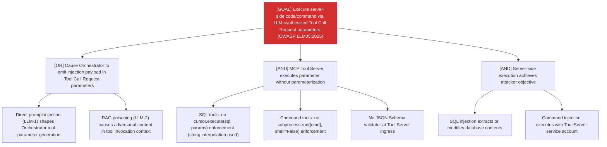

# Attack Tree: OI-2 — LLM Agent Orchestrator

**Risk Level**: Critical
**Component**: LLM Agent Orchestrator
**Threat**: Server-side code/command execution via LLM-synthesized Tool Call Request (OWASP LLM05:2025)

