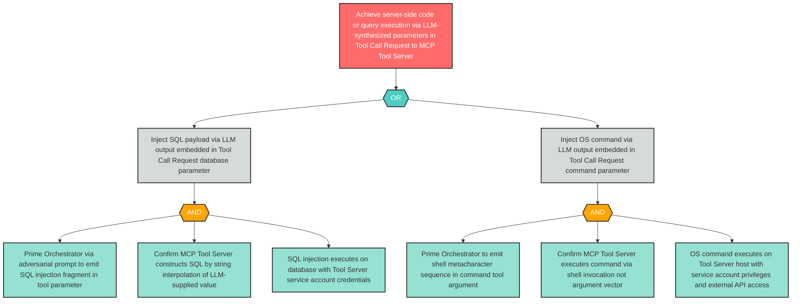

# Attack Tree: OI-2 — Server-Side Code Execution via LLM-Synthesized Tool Call Request Parameters

**Finding ID**: OI-2
**Risk Level**: Critical
**Component**: LLM Agent Orchestrator
**Delta Status**: UNCHANGED

