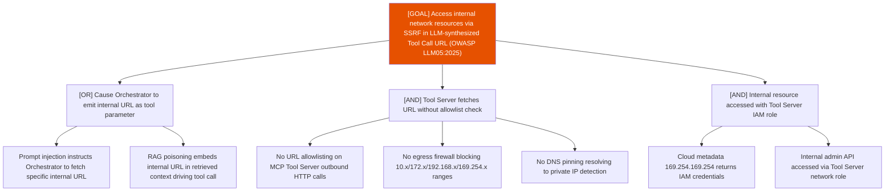

# Attack Tree: OI-3 — LLM Agent Orchestrator

**Risk Level**: High
**Component**: LLM Agent Orchestrator
**Threat**: SSRF via LLM-synthesized URL in Tool Call Request to MCP Tool Server (OWASP LLM05:2025)

