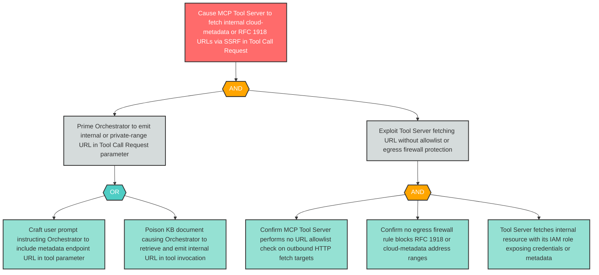

# Attack Tree: OI-3 — SSRF via LLM-Synthesized URL in Tool Call Request to MCP Tool Server

**Finding ID**: OI-3
**Risk Level**: High
**Component**: LLM Agent Orchestrator
**Delta Status**: UNCHANGED

