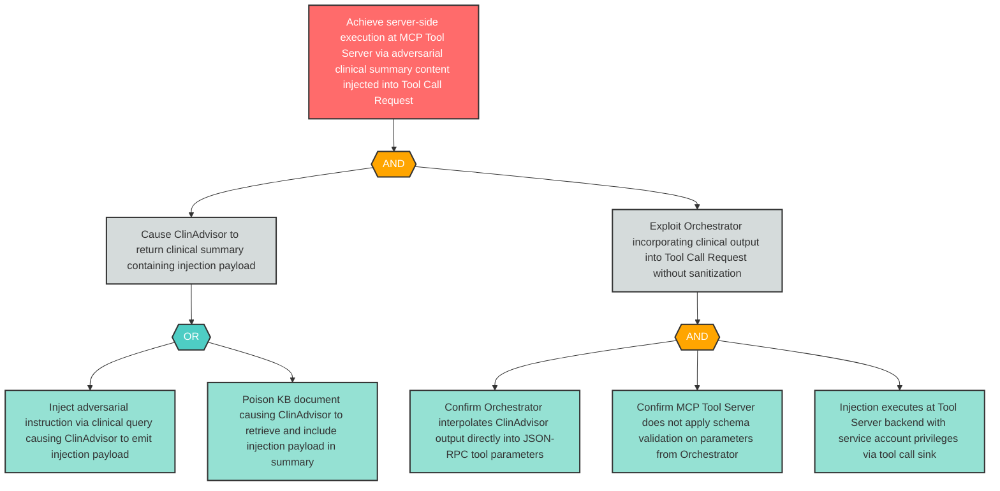

# Attack Tree: OI-4 — Server-Side Execution via Clinical Summary Content Injected into Orchestrator Tool Call

**Finding ID**: OI-4
**Risk Level**: High
**Component**: Clinical Advisory Sub-Agent
**Delta Status**: UNCHANGED

