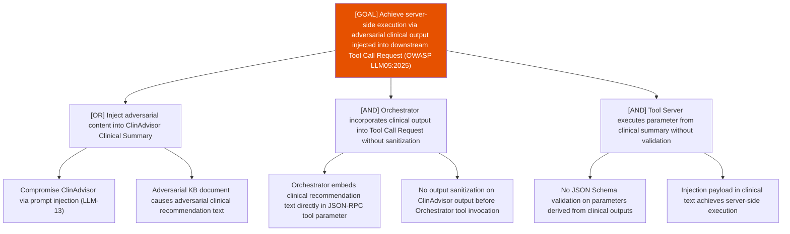

# Attack Tree: OI-4 — Clinical Advisory Sub-Agent

**Risk Level**: High
**Component**: Clinical Advisory Sub-Agent
**Threat**: Server-side execution via clinical summary injected into Orchestrator Tool Call Request (OWASP LLM05:2025)

