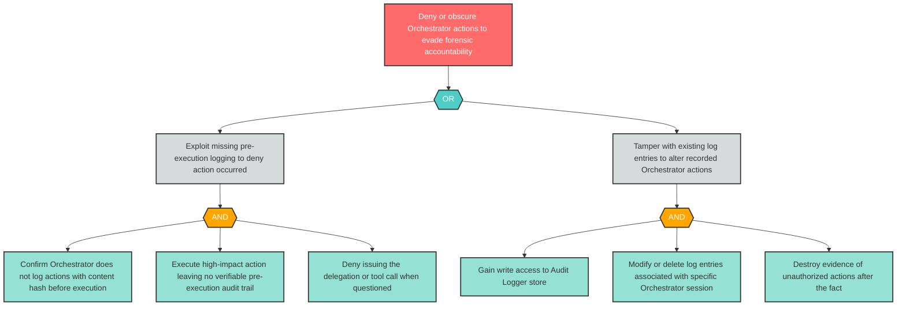

# Attack Tree: R-3 — Orchestrator Actions Cannot Be Attributed Without Content-Hash Audit Log

**Finding ID**: R-3
**Risk Level**: Critical
**Component**: LLM Agent Orchestrator
**Delta Status**: UNCHANGED

