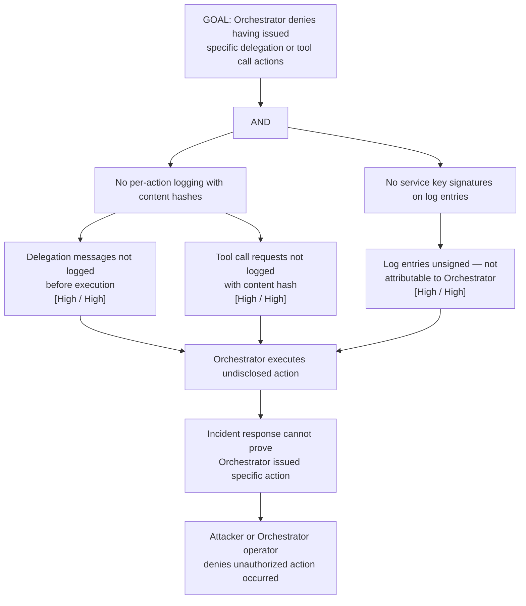

# Attack Tree: R-3 — LLM Agent Orchestrator Action Repudiation

**Chain-breaking control**: Log every Orchestrator action with action type, content hash, session/request ID, monotonic sequence number, and service key signature. Actions MUST be logged before execution, not after.
