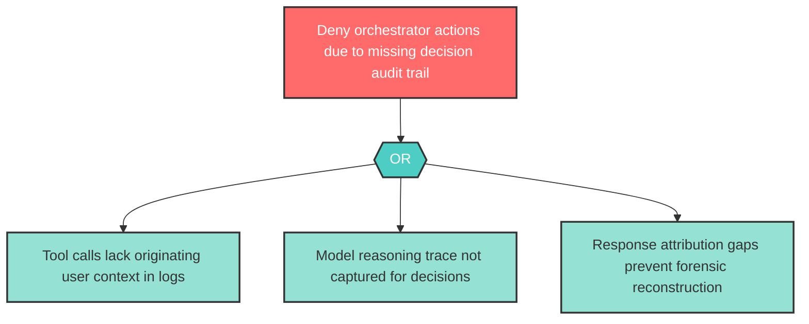

# Attack Tree: R-3 -- Missing Decision Chain Audit Trail

| Field | Value |
|-------|-------|
| Finding ID | R-3 |
| Component | LLM Agent Orchestrator |
| Risk Level | High |
| Threat | Missing Decision Chain Audit Trail |
| Correlation | CG-3 (See also: AG-2) |

