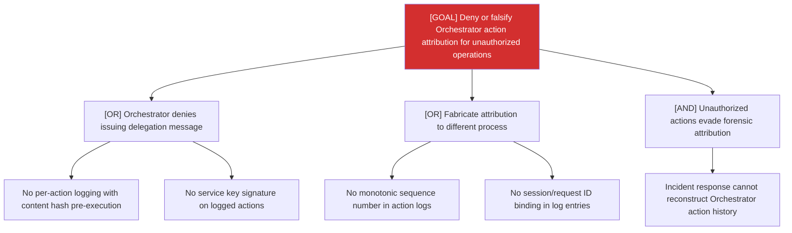

# Attack Tree: R-3 — LLM Agent Orchestrator

**Risk Level**: Critical
**Component**: LLM Agent Orchestrator
**Threat**: Orchestrator actions cannot be attributed without non-repudiable logs

```mermaid
graph TD
    Goal["[GOAL] Deny or falsify Orchestrator action attribution for unauthorized operations"]
    Goal --> A["[OR] Orchestrator denies issuing delegation message"]
    A --> A1["No per-action logging with content hash pre-execution"]
    A --> A2["No service key signature on logged actions"]
    Goal --> B["[OR] Fabricate attribution to different process"]
    B --> B1["No monotonic sequence number in action logs"]
    B --> B2["No session/request ID binding in log entries"]
    Goal --> C["[AND] Unauthorized actions evade forensic attribution"]
    C --> C1["Incident response cannot reconstruct Orchestrator action history"]
    classDef critical fill:#d32f2f,color:#fff
    class Goal critical
```
