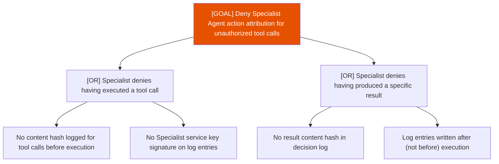

# Attack Tree: R-4 — Specialist Agent

**Risk Level**: High
**Component**: Specialist Agent
**Threat**: Specialist denies tool calls or results without signed logs

```mermaid
graph TD
    Goal["[GOAL] Deny Specialist Agent action attribution for unauthorized tool calls"]
    Goal --> A["[OR] Specialist denies having executed a tool call"]
    A --> A1["No content hash logged for tool calls before execution"]
    A --> A2["No Specialist service key signature on log entries"]
    Goal --> B["[OR] Specialist denies having produced a specific result"]
    B --> B1["No result content hash in decision log"]
    B --> B2["Log entries written after (not before) execution"]
    classDef high fill:#e65100,color:#fff
    class Goal high
```
