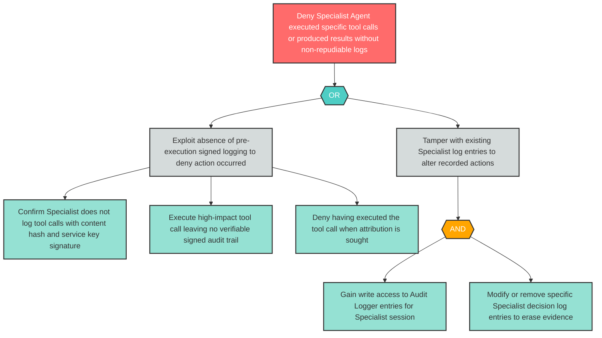

# Attack Tree: R-4 — Specialist Agent Denies Executed Tool Calls Without Signed Decision Logs

**Finding ID**: R-4
**Risk Level**: High
**Component**: Specialist Agent
**Delta Status**: UNCHANGED

```mermaid
flowchart TD
    R4_root["Deny Specialist Agent executed specific tool calls or produced results without non-repudiable logs"]
    R4_or1{{"OR"}}
    R4_sub1["Exploit absence of pre-execution signed logging to deny action occurred"]
    R4_sub2["Tamper with existing Specialist log entries to alter recorded actions"]
    R4_leaf1["Confirm Specialist does not log tool calls with content hash and service key signature"]
    R4_leaf2["Execute high-impact tool call leaving no verifiable signed audit trail"]
    R4_leaf3["Deny having executed the tool call when attribution is sought"]
    R4_and1{{"AND"}}
    R4_leaf4["Gain write access to Audit Logger entries for Specialist session"]
    R4_leaf5["Modify or remove specific Specialist decision log entries to erase evidence"]

    R4_root --> R4_or1
    R4_or1 --> R4_sub1
    R4_or1 --> R4_sub2
    R4_sub1 --> R4_leaf1
    R4_sub1 --> R4_leaf2
    R4_sub1 --> R4_leaf3
    R4_sub2 --> R4_and1
    R4_and1 --> R4_leaf4
    R4_and1 --> R4_leaf5

    classDef goal fill:#ff6b6b,stroke:#333,stroke-width:2px,color:#fff
    classDef andGate fill:#ffa500,stroke:#333,stroke-width:2px,color:#fff
    classDef orGate fill:#4ecdc4,stroke:#333,stroke-width:2px,color:#fff
    classDef subGoal fill:#d5dbdb,stroke:#333,stroke-width:2px,color:#333
    classDef leaf fill:#95e1d3,stroke:#333,stroke-width:2px,color:#333

    class R4_root goal
    class R4_or1 orGate
    class R4_and1 andGate
    class R4_sub1,R4_sub2 subGoal
    class R4_leaf1,R4_leaf2,R4_leaf3,R4_leaf4,R4_leaf5 leaf
```
