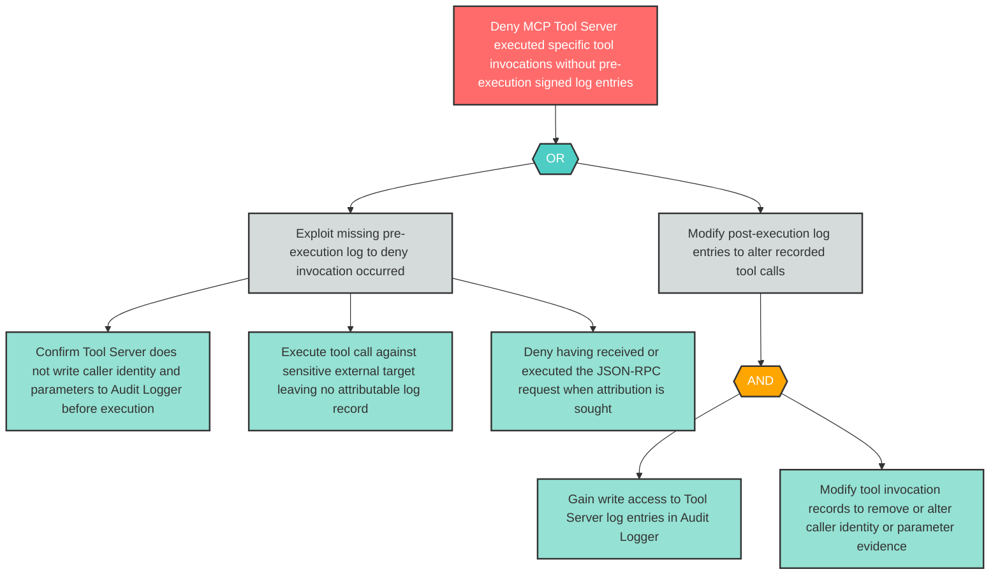

# Attack Tree: R-6 — MCP Tool Server Denies Having Executed Specific Tool Invocations

**Finding ID**: R-6
**Risk Level**: High
**Component**: MCP Tool Server
**Delta Status**: UNCHANGED

```mermaid
flowchart TD
    R6_root["Deny MCP Tool Server executed specific tool invocations without pre-execution signed log entries"]
    R6_or1{{"OR"}}
    R6_sub1["Exploit missing pre-execution log to deny invocation occurred"]
    R6_sub2["Modify post-execution log entries to alter recorded tool calls"]
    R6_leaf1["Confirm Tool Server does not write caller identity and parameters to Audit Logger before execution"]
    R6_leaf2["Execute tool call against sensitive external target leaving no attributable log record"]
    R6_leaf3["Deny having received or executed the JSON-RPC request when attribution is sought"]
    R6_and1{{"AND"}}
    R6_leaf4["Gain write access to Tool Server log entries in Audit Logger"]
    R6_leaf5["Modify tool invocation records to remove or alter caller identity or parameter evidence"]

    R6_root --> R6_or1
    R6_or1 --> R6_sub1
    R6_or1 --> R6_sub2
    R6_sub1 --> R6_leaf1
    R6_sub1 --> R6_leaf2
    R6_sub1 --> R6_leaf3
    R6_sub2 --> R6_and1
    R6_and1 --> R6_leaf4
    R6_and1 --> R6_leaf5

    classDef goal fill:#ff6b6b,stroke:#333,stroke-width:2px,color:#fff
    classDef andGate fill:#ffa500,stroke:#333,stroke-width:2px,color:#fff
    classDef orGate fill:#4ecdc4,stroke:#333,stroke-width:2px,color:#fff
    classDef subGoal fill:#d5dbdb,stroke:#333,stroke-width:2px,color:#333
    classDef leaf fill:#95e1d3,stroke:#333,stroke-width:2px,color:#333

    class R6_root goal
    class R6_or1 orGate
    class R6_and1 andGate
    class R6_sub1,R6_sub2 subGoal
    class R6_leaf1,R6_leaf2,R6_leaf3,R6_leaf4,R6_leaf5 leaf
```
