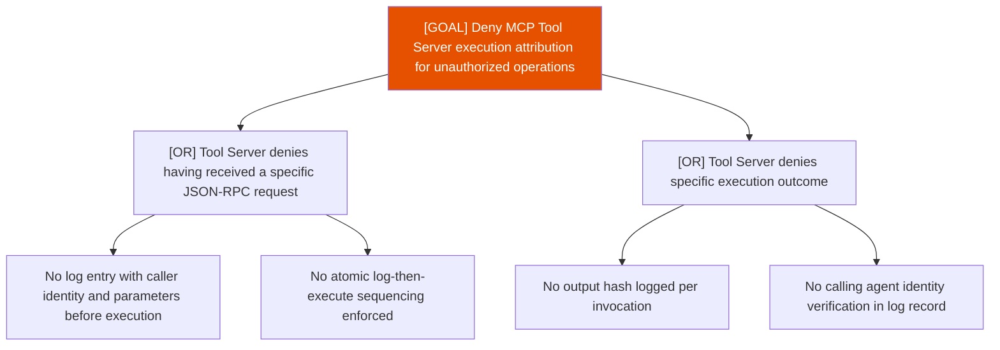

# Attack Tree: R-6 — MCP Tool Server

**Risk Level**: High
**Component**: MCP Tool Server
**Threat**: Tool Server denies having executed specific invocation

```mermaid
graph TD
    Goal["[GOAL] Deny MCP Tool Server execution attribution for unauthorized operations"]
    Goal --> A["[OR] Tool Server denies having received a specific JSON-RPC request"]
    A --> A1["No log entry with caller identity and parameters before execution"]
    A --> A2["No atomic log-then-execute sequencing enforced"]
    Goal --> B["[OR] Tool Server denies specific execution outcome"]
    B --> B1["No output hash logged per invocation"]
    B --> B2["No calling agent identity verification in log record"]
    classDef high fill:#e65100,color:#fff
    class Goal high
```
