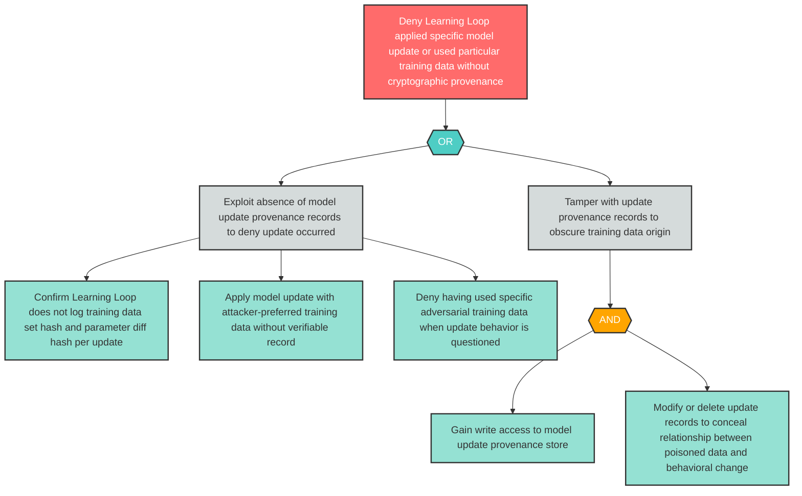

# Attack Tree: R-7 — Learning Loop Denies Applying Specific Model Update Without Provenance Records

**Finding ID**: R-7
**Risk Level**: High
**Component**: Long-Running Learning Loop
**Delta Status**: UNCHANGED

