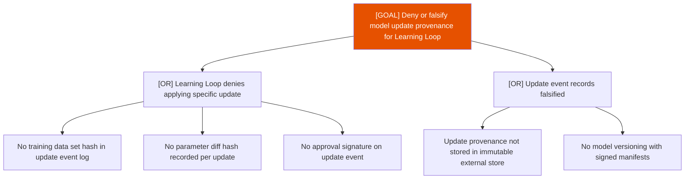

# Attack Tree: R-7 — Long-Running Learning Loop

**Risk Level**: High
**Component**: Long-Running Learning Loop
**Threat**: Learning Loop denies having applied specific model update

```mermaid
graph TD
    Goal["[GOAL] Deny or falsify model update provenance for Learning Loop"]
    Goal --> A["[OR] Learning Loop denies applying specific update"]
    A --> A1["No training data set hash in update event log"]
    A --> A2["No parameter diff hash recorded per update"]
    A --> A3["No approval signature on update event"]
    Goal --> B["[OR] Update event records falsified"]
    B --> B1["Update provenance not stored in immutable external store"]
    B --> B2["No model versioning with signed manifests"]
    classDef high fill:#e65100,color:#fff
    class Goal high
```
