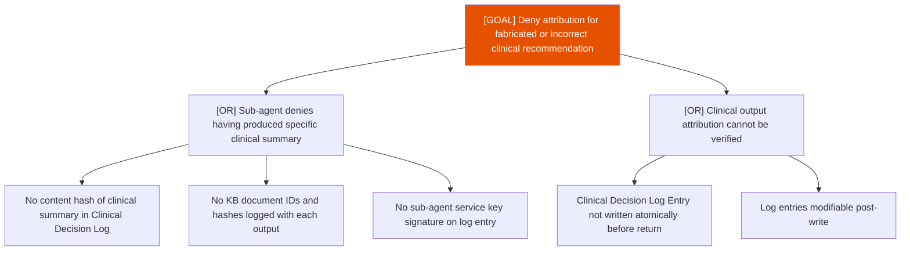

# Attack Tree: R-9 — Clinical Advisory Sub-Agent

**Risk Level**: High
**Component**: Clinical Advisory Sub-Agent
**Threat**: ClinAdvisor denies generating specific clinical output

```mermaid
graph TD
    Goal["[GOAL] Deny attribution for fabricated or incorrect clinical recommendation"]
    Goal --> A["[OR] Sub-agent denies having produced specific clinical summary"]
    A --> A1["No content hash of clinical summary in Clinical Decision Log"]
    A --> A2["No KB document IDs and hashes logged with each output"]
    A --> A3["No sub-agent service key signature on log entry"]
    Goal --> B["[OR] Clinical output attribution cannot be verified"]
    B --> B1["Clinical Decision Log Entry not written atomically before return"]
    B --> B2["Log entries modifiable post-write"]
    classDef high fill:#e65100,color:#fff
    class Goal high
```
