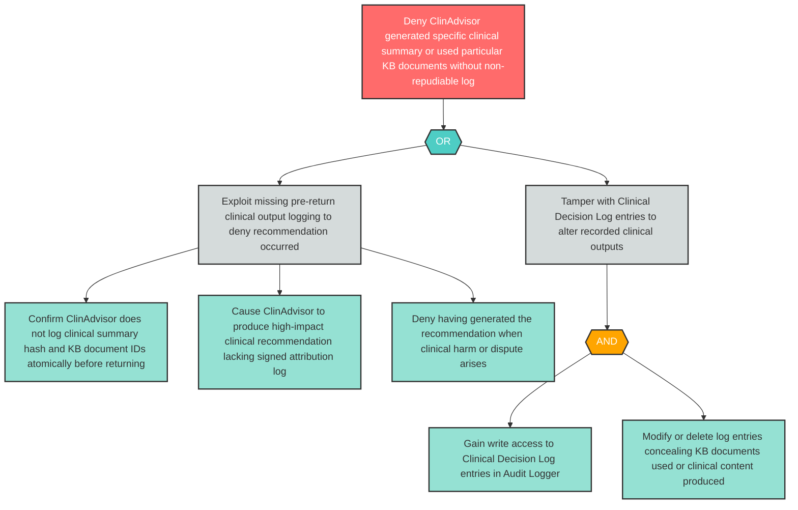

# Attack Tree: R-9 — ClinAdvisor Denies Generating Specific Clinical Summary Without Non-Repudiable Log

**Finding ID**: R-9
**Risk Level**: High
**Component**: Clinical Advisory Sub-Agent
**Delta Status**: UNCHANGED

