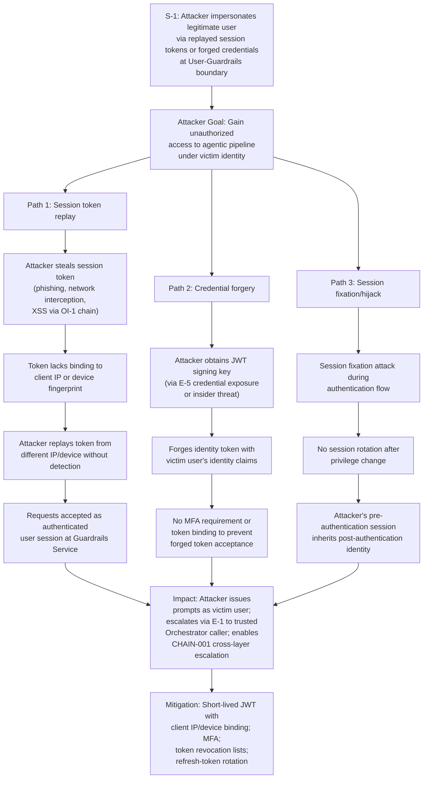

# Attack Tree: S-1 — User Identity Spoofing

**Finding**: S-1 | Spoofing | Risk Level: Critical

```mermaid
graph TD
    ROOT["S-1: Attacker impersonates legitimate user<br/>via replayed session tokens or forged credentials<br/>at User-Guardrails boundary"]
    ROOT --> A["Attacker Goal: Gain unauthorized<br/>access to agentic pipeline<br/>under victim identity"]

    A --> B["Path 1: Session token replay"]
    B --> B1["Attacker steals session token<br/>(phishing, network interception,<br/>XSS via OI-1 chain)"]
    B1 --> B2["Token lacks binding to<br/>client IP or device fingerprint"]
    B2 --> B3["Attacker replays token from<br/>different IP/device without detection"]
    B3 --> B4["Requests accepted as authenticated<br/>user session at Guardrails Service"]

    A --> C["Path 2: Credential forgery"]
    C --> C1["Attacker obtains JWT signing key<br/>(via E-5 credential exposure<br/>or insider threat)"]
    C1 --> C2["Forges identity token with<br/>victim user's identity claims"]
    C2 --> C3["No MFA requirement or<br/>token binding to prevent<br/>forged token acceptance"]

    A --> D["Path 3: Session fixation/hijack"]
    D --> D1["Session fixation attack during<br/>authentication flow"]
    D1 --> D2["No session rotation after<br/>privilege change"]
    D2 --> D3["Attacker's pre-authentication session<br/>inherits post-authentication identity"]

    B4 --> IMPACT["Impact: Attacker issues<br/>prompts as victim user;<br/>escalates via E-1 to trusted<br/>Orchestrator caller; enables<br/>CHAIN-001 cross-layer escalation"]
    C3 --> IMPACT
    D3 --> IMPACT

    IMPACT --> MITIG["Mitigation: Short-lived JWT with<br/>client IP/device binding; MFA;<br/>token revocation lists;<br/>refresh-token rotation"]
```
