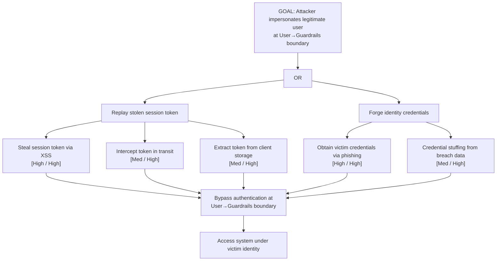

# Attack Tree: S-1 — User Identity Spoofing

**Chain-breaking control**: Implement short-lived JWT tokens with binding to client IP/device fingerprint. Enforce MFA for all user sessions. Use token revocation lists and refresh-token rotation with binding checks.
