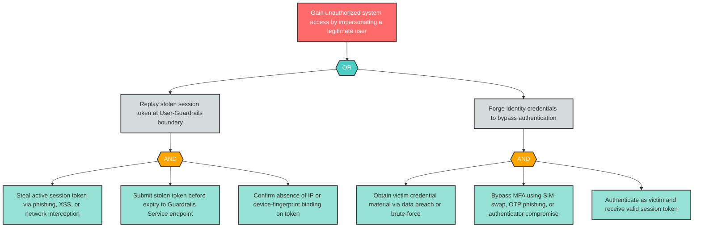

# Attack Tree: S-1 — Session Token Replay / Identity Credential Forgery

**Finding ID**: S-1
**Risk Level**: Critical
**Component**: User
**Delta Status**: UNCHANGED

```mermaid
flowchart TD
    S1_root["Gain unauthorized system access by impersonating a legitimate user"]
    S1_or1{{"OR"}}
    S1_sub1["Replay stolen session token at User-Guardrails boundary"]
    S1_sub2["Forge identity credentials to bypass authentication"]
    S1_and1{{"AND"}}
    S1_leaf1["Steal active session token via phishing, XSS, or network interception"]
    S1_leaf2["Submit stolen token before expiry to Guardrails Service endpoint"]
    S1_leaf3["Confirm absence of IP or device-fingerprint binding on token"]
    S1_and2{{"AND"}}
    S1_leaf4["Obtain victim credential material via data breach or brute-force"]
    S1_leaf5["Bypass MFA using SIM-swap, OTP phishing, or authenticator compromise"]
    S1_leaf6["Authenticate as victim and receive valid session token"]

    S1_root --> S1_or1
    S1_or1 --> S1_sub1
    S1_or1 --> S1_sub2
    S1_sub1 --> S1_and1
    S1_and1 --> S1_leaf1
    S1_and1 --> S1_leaf2
    S1_and1 --> S1_leaf3
    S1_sub2 --> S1_and2
    S1_and2 --> S1_leaf4
    S1_and2 --> S1_leaf5
    S1_and2 --> S1_leaf6

    classDef goal fill:#ff6b6b,stroke:#333,stroke-width:2px,color:#fff
    classDef andGate fill:#ffa500,stroke:#333,stroke-width:2px,color:#fff
    classDef orGate fill:#4ecdc4,stroke:#333,stroke-width:2px,color:#fff
    classDef subGoal fill:#d5dbdb,stroke:#333,stroke-width:2px,color:#333
    classDef leaf fill:#95e1d3,stroke:#333,stroke-width:2px,color:#333

    class S1_root goal
    class S1_or1 orGate
    class S1_and1,S1_and2 andGate
    class S1_sub1,S1_sub2 subGoal
    class S1_leaf1,S1_leaf2,S1_leaf3,S1_leaf4,S1_leaf5,S1_leaf6 leaf
```
