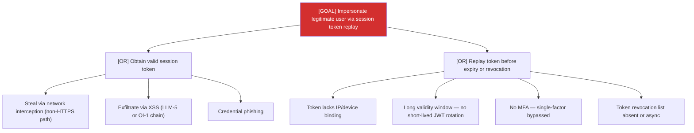

# Attack Tree: S-1 — User

**Risk Level**: Critical
**Component**: User
**Threat**: Session token replay to impersonate legitimate user

```mermaid
graph TD
    Goal["[GOAL] Impersonate legitimate user via session token replay"]
    Goal --> A["[OR] Obtain valid session token"]
    A --> A1["Steal via network interception (non-HTTPS path)"]
    A --> A2["Exfiltrate via XSS (LLM-5 or OI-1 chain)"]
    A --> A3["Credential phishing"]
    Goal --> B["[OR] Replay token before expiry or revocation"]
    B --> B1["Token lacks IP/device binding"]
    B --> B2["Long validity window — no short-lived JWT rotation"]
    B --> B3["No MFA — single-factor bypassed"]
    B --> B4["Token revocation list absent or async"]
    classDef critical fill:#d32f2f,color:#fff
    class Goal critical
```
