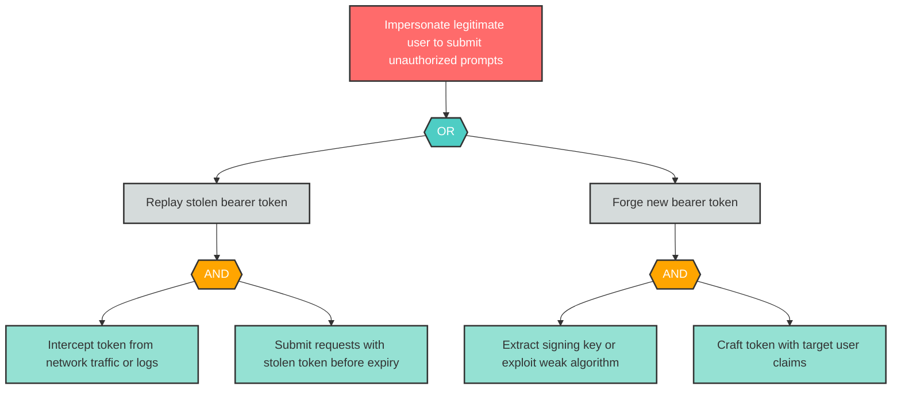

# Attack Tree: S-1 -- User Identity Spoofing via Token Replay

| Field | Value |
|-------|-------|
| Finding ID | S-1 |
| Component | User |
| Risk Level | High |
| Threat | User Identity Spoofing via Token Replay |
| Correlation | None |

