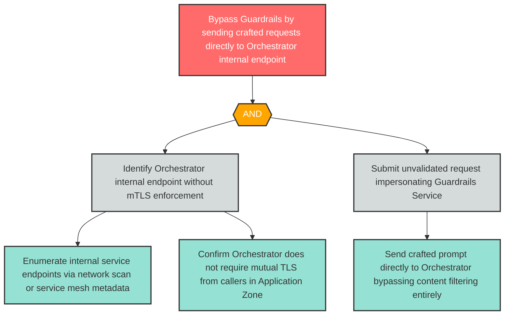

# Attack Tree: S-2 — Application Zone Process Bypasses Guardrails by Spoofing Direct Orchestrator Access

**Finding ID**: S-2
**Risk Level**: High
**Component**: Guardrails Service
**Delta Status**: UNCHANGED

