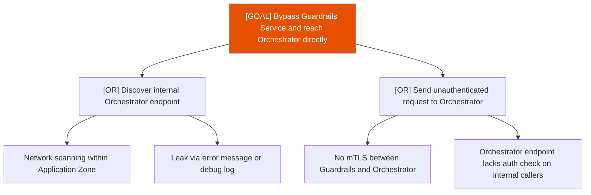

# Attack Tree: S-2 — Guardrails Service

**Risk Level**: High
**Component**: Guardrails Service
**Threat**: Attacker bypasses Guardrails to reach Orchestrator directly

```mermaid
graph TD
    Goal["[GOAL] Bypass Guardrails Service and reach Orchestrator directly"]
    Goal --> A["[OR] Discover internal Orchestrator endpoint"]
    A --> A1["Network scanning within Application Zone"]
    A --> A2["Leak via error message or debug log"]
    Goal --> B["[OR] Send unauthenticated request to Orchestrator"]
    B --> B1["No mTLS between Guardrails and Orchestrator"]
    B --> B2["Orchestrator endpoint lacks auth check on internal callers"]
    classDef high fill:#e65100,color:#fff
    class Goal high
```
