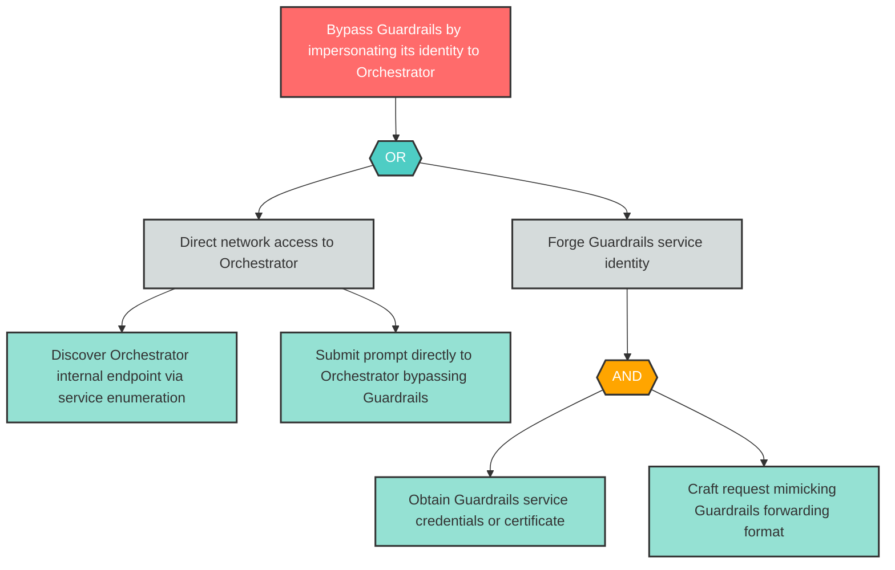

# Attack Tree: S-2 -- Guardrails Bypass via Service Impersonation

| Field | Value |
|-------|-------|
| Finding ID | S-2 |
| Component | Guardrails Service |
| Risk Level | High |
| Threat | Guardrails Bypass via Service Impersonation |
| Correlation | None |

