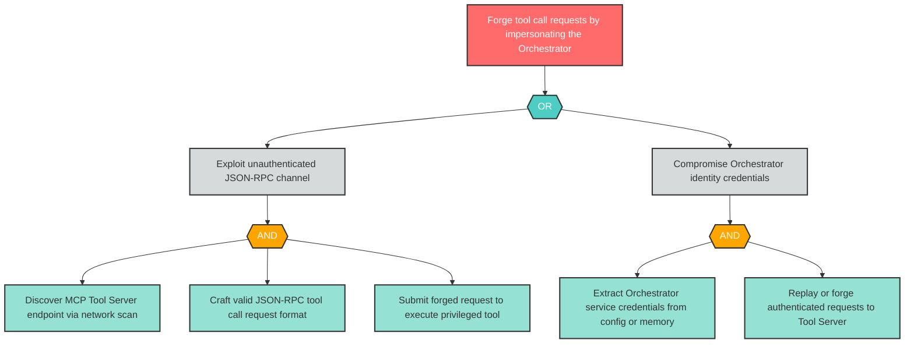

# Attack Tree: S-3 -- Orchestrator Impersonation on JSON-RPC Channel

| Field | Value |
|-------|-------|
| Finding ID | S-3 |
| Component | LLM Agent Orchestrator |
| Risk Level | Critical |
| Threat | Orchestrator Impersonation on JSON-RPC Channel |
| Correlation | None |

