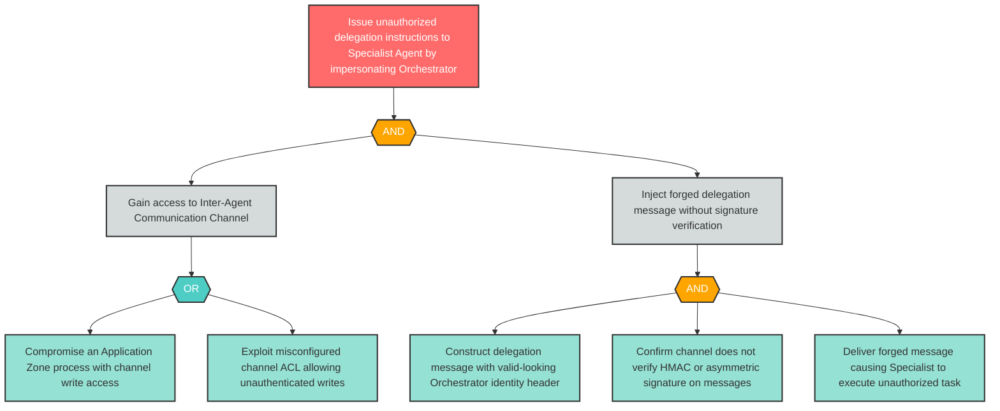

# Attack Tree: S-3 — Rogue Process Impersonates Orchestrator via Unsigned Channel Messages

**Finding ID**: S-3
**Risk Level**: Critical
**Component**: LLM Agent Orchestrator
**Delta Status**: UNCHANGED

