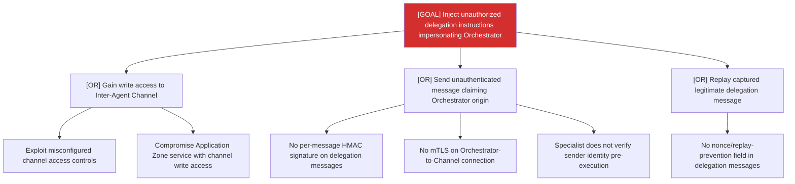

# Attack Tree: S-3 — LLM Agent Orchestrator

**Risk Level**: Critical
**Component**: LLM Agent Orchestrator
**Threat**: Injection of delegation instructions impersonating Orchestrator

```mermaid
graph TD
    Goal["[GOAL] Inject unauthorized delegation instructions impersonating Orchestrator"]
    Goal --> A["[OR] Gain write access to Inter-Agent Channel"]
    A --> A1["Exploit misconfigured channel access controls"]
    A --> A2["Compromise Application Zone service with channel write access"]
    Goal --> B["[OR] Send unauthenticated message claiming Orchestrator origin"]
    B --> B1["No per-message HMAC signature on delegation messages"]
    B --> B2["No mTLS on Orchestrator-to-Channel connection"]
    B --> B3["Specialist does not verify sender identity pre-execution"]
    Goal --> C["[OR] Replay captured legitimate delegation message"]
    C --> C1["No nonce/replay-prevention field in delegation messages"]
    classDef critical fill:#d32f2f,color:#fff
    class Goal critical
```
