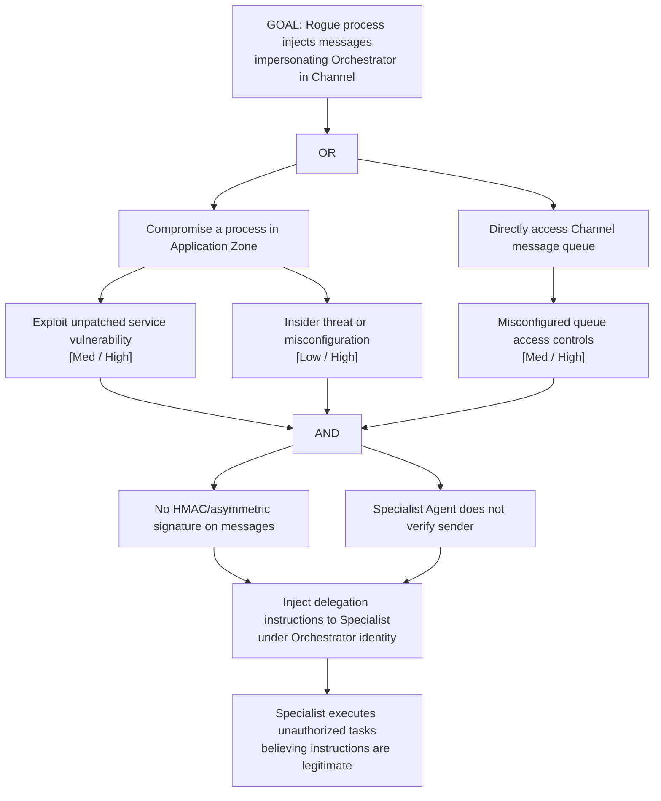

# Attack Tree: S-3 — LLM Agent Orchestrator Identity Spoofing

**Chain-breaking control**: Authenticate all Orchestrator→Channel messages using HMAC or asymmetric signing with per-session keys. The Specialist Agent MUST verify the signature before acting on delegated tasks.
