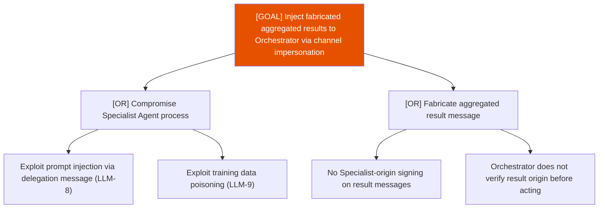

# Attack Tree: S-4 — Specialist Agent

**Risk Level**: High
**Component**: Specialist Agent
**Threat**: Specialist impersonates Orchestrator to inject fabricated aggregated results

```mermaid
graph TD
    Goal["[GOAL] Inject fabricated aggregated results to Orchestrator via channel impersonation"]
    Goal --> A["[OR] Compromise Specialist Agent process"]
    A --> A1["Exploit prompt injection via delegation message (LLM-8)"]
    A --> A2["Exploit training data poisoning (LLM-9)"]
    Goal --> B["[OR] Fabricate aggregated result message"]
    B --> B1["No Specialist-origin signing on result messages"]
    B --> B2["Orchestrator does not verify result origin before acting"]
    classDef high fill:#e65100,color:#fff
    class Goal high
```
