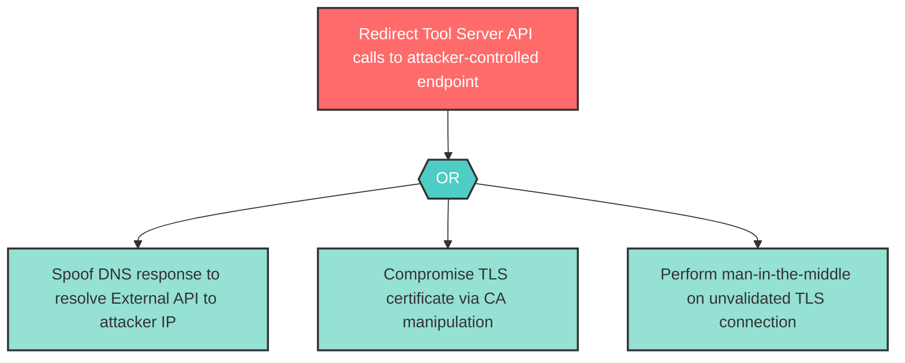

# Attack Tree: S-4 -- DNS Spoofing to Redirect External API Calls

| Field | Value |
|-------|-------|
| Finding ID | S-4 |
| Component | MCP Tool Server |
| Risk Level | High |
| Threat | DNS Spoofing to Redirect External API Calls |
| Correlation | None |

