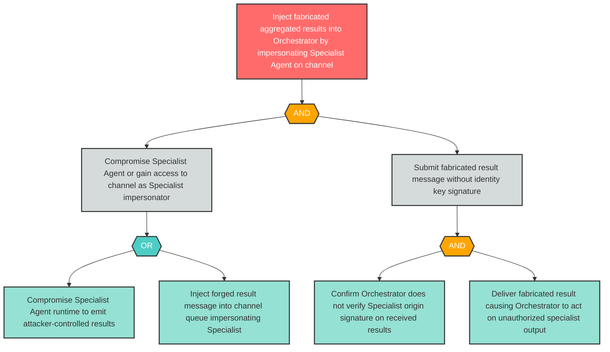

# Attack Tree: S-4 — Compromised Specialist Injects Fabricated Aggregated Results to Orchestrator

**Finding ID**: S-4
**Risk Level**: High
**Component**: Specialist Agent
**Delta Status**: UNCHANGED

